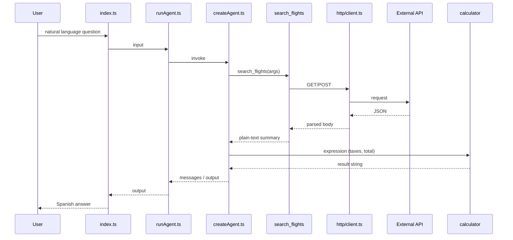

# Architecture

This project implements an agent with LangChain tools using a modular structure designed for clarity, testability, and incremental extension. It aligns with `docs/brief-agent.md` and `docs/plan-agent.md`.

## End-to-end flow

### Today (local tools)

1. The CLI receives user `input` in `src/index.ts`.
2. `runAgent` in `src/agent/runAgent.ts` creates or receives an agent executor.
3. `buildAgentExecutor` in `src/agent/createAgent.ts` composes model, prompt, and tools.
4. The agent selects and executes the appropriate tool based on the prompt:
   - `calculator`
   - `current_time`
5. The executor returns the final `output` to the caller.

### Planned (HTTP tools + chaining)

When external integrations are enabled (see Phase 6 in `docs/plan-agent.md`):

1. Steps 1–3 remain the same.
2. For queries that need live data (e.g. flight prices), the agent may call an HTTP-backed tool such as `search_flights`.
3. That tool uses a shared HTTP client, calls the third-party API, parses JSON, and returns a **plain-text summary** to the model (not the raw JSON payload).
4. For follow-up math (taxes, totals, budget checks), the agent may call `calculator` in a second step.
5. The executor returns a Spanish answer that explains what was done and states that prices are indicative when applicable.

Example chain (study case): *“Can I travel to Japan on a $2000 budget?”* → `search_flights` → `calculator` → final reply.

## Layered structure

| Layer | Location | Responsibility |
|-------|----------|----------------|
| Interface | `src/index.ts` | CLI entry; passes user input to the runtime. |
| Application | `src/agent/runAgent.ts` | Single execution API; supports injected executor for tests. |
| Composition | `src/agent/createAgent.ts`, `prompt.ts`, `model.ts` | Model, system prompt, tool registry. |
| Domain tools (local) | `src/agent/tools/calculator.ts`, `currentTime.ts` | No network; synchronous or local data. |
| Domain tools (HTTP) | `src/agent/tools/flights/*` (planned) | Orchestrate API call + formatting; expose LangChain `tool()`. |
| HTTP infrastructure | `src/agent/http/*` (planned) | Shared `fetch`, timeouts, error mapping; no tool-specific business rules. |
| Configuration | `src/config/env.ts` | Load `env.local`; validate OpenRouter and external API variables with `zod`. |

## Module responsibilities

### Implemented

- `src/config/env.ts`
  - Loads `env.local`.
  - Validates OpenRouter-related environment variables with `zod`.
- `src/agent/model.ts`
  - Creates the `ChatOpenAI` model configured against OpenRouter.
- `src/agent/prompt.ts`
  - Defines agent behavior and tool-usage instructions.
- `src/agent/tools/*`
  - Reusable domain tools (`calculator`, `current_time`).
- `src/agent/createAgent.ts`
  - Assembles model, tools, and prompt into the executable agent.
- `src/agent/runAgent.ts`
  - Exposes a focused execution interface for CLI and tests.
- `src/agent/verboseLog.ts` (optional runtime)
  - Human-readable trace of agent steps when verbose mode is on.

### Planned (HTTP extension)

- `src/agent/http/client.ts`
  - HTTP requests with timeout (`AbortSignal`).
  - Reads credentials from `getEnv()`; never logs secrets or full response bodies.
  - Optional host allowlist for the configured provider.
- `src/agent/http/errors.ts`
  - Maps HTTP/network failures to short, agent-friendly error strings.
- `src/agent/tools/flights/formatFlightOffers.ts`
  - Converts API JSON into a bounded plain-text list (top N offers: route, date, price, currency, carrier).
- `src/agent/tools/flights/searchFlights.ts`
  - LangChain tool: Zod input schema → client → formatter → `string` return value.
- `src/config/env.ts` (extended)
  - Additional variables, e.g. `FLIGHTS_API_BASE_URL`, `FLIGHTS_API_KEY`, optional `FLIGHTS_HTTP_TIMEOUT_MS`.

## Tool contract (HTTP)

Every HTTP-backed tool should follow the same pattern:

1. **Input:** Zod schema with only parameters the model can infer or ask for (airports/cities, dates, limits).
2. **Execution:** Call shared HTTP client; handle auth if the provider requires it (e.g. OAuth token cache in a small helper).
3. **Output:** Always a `string`—either a formatted summary or a clear error message for the agent.
4. **Registration:** Export tool from `src/agent/tools/...`, add to `agentTools` in `createAgent.ts`, document usage in `prompt.ts`.
5. **Tests:** Unit-test the formatter with JSON fixtures; test the tool with mocked `fetch` or an injectable client—no live API in CI.

Do not combine HTTP and math in one tool; keep `calculator` separate so chains stay testable and match the pedagogical model in the brief.

## Configuration

| Variable group | Purpose |
|----------------|---------|
| `OPENROUTER_*` | LLM provider (required today). |
| `FLIGHTS_*` (planned) | Third-party flight search API. |

Missing required variables should fail at startup via `getEnv()`, not at first tool call with an opaque error.

## Design decisions

- **TypeScript ESM** for alignment with the modern Node.js ecosystem.
- **Centralized environment validation** to fail fast on invalid configuration.
- **OpenRouter** via the OpenAI-compatible API surface with provider-specific headers.
- **Injectable executor** in `runAgent` for isolated, fast unit tests.
- **Native `fetch`** for HTTP tools; avoid extra HTTP libraries unless clearly justified.
- **Plain-text tool results** to limit tokens and reduce hallucination from large JSON blobs.
- **One concern per tool**—local vs HTTP vs formatting—so each piece can be tested and replaced independently.

## Testing strategy

| Target | Approach |
|--------|----------|
| Local tools | Direct `tool.invoke()` (see `tests/calculator.test.ts`, `tests/currentTime.test.ts`). |
| Agent runner | Mock executor in `tests/runAgent.test.ts`. |
| JSON formatters | Fixtures under `tests/fixtures/` (planned). |
| HTTP tools | Mock `fetch` or inject HTTP client; no paid API calls in `npm test`. |
| Manual E2E | Documented CLI example with real credentials in `env.local` only. |

## Security and operations

- Store API keys only in `env.local` (gitignored).
- Enforce request timeouts and cap the number of offers returned to the model.
- Log tool name, duration, and HTTP status in verbose mode—not API keys or PII-heavy payloads.
- Treat flight prices as indicative; no booking or payment flows in this agent.

## Recommended evolution

- Replace `Function(...)` in `calculator` with a safe parser/evaluator for production use.
- Implement Phase 6: `http/client` → env extension → flight formatter + tests → `search_flights` → prompt and README.
- Add `docs/extending-http-tools.md` with a short checklist for future APIs (weather, exchange rates, etc.).
- Add structured logging when deeper runtime diagnostics are required, keeping redaction rules above.

## Related documentation

- `docs/brief-agent.md` — product intent, limits, and capabilities table.
- `docs/plan-agent.md` — phased delivery, including Fase 6 (HTTP integrations).
- `README.md` — setup, scripts, and how to add a new tool.
